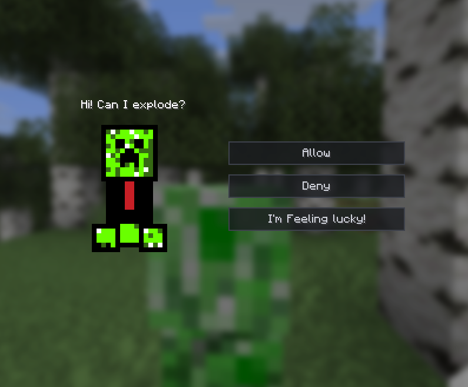

When a creeper is about to explode near you, a GUI pops up asking for your permission:

* **Allow**: Lets the creeper instantly explode and makes it send a "Sorry" message in chat
* **Deny**: Cancels the explosion, removes the creeper, spawns heart particles, and drops a signed book
* **I'm feeling lucky!**: Picks a random choice automatically

